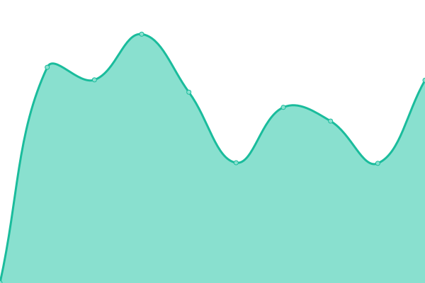

# [📈 Live Status](https://status.ashish.me): <!--live status--> **🟧 Partial outage**

This repository contains the open-source uptime monitor and status page for [Ashish Patel](https://ashish.me), powered by [Upptime](https://github.com/upptime/upptime).

With [Upptime](https://upptime.js.org), you can get your own unlimited and free uptime monitor and status page, powered entirely by a GitHub repository. We use [Issues](https://github.com/ashishdotme/status.ashish.me/issues) as incident reports, [Actions](https://github.com/ashishdotme/status.ashish.me/actions) as uptime monitors, and [Pages](https://status.ashish.me) for the status page.

<!--start: status pages-->
<!-- This summary is generated by Upptime (https://github.com/upptime/upptime) -->
<!-- Do not edit this manually, your changes will be overwritten -->
<!-- prettier-ignore -->
| URL | Status | History | Response Time | Uptime |
| --- | ------ | ------- | ------------- | ------ |
|  [Scrobbler](https://scrobbler.ashish.me/health) | 🟩 Up | [scrobbler.yml](https://github.com/ashishdotme/status.ashish.me/commits/HEAD/history/scrobbler.yml) | 

 1076ms
     
 | 

<a href="https://status.ashish.me/history/scrobbler">100.00%</a>
    

|  [Jobs API](https://jobsapi.ashish.me/) | 🟥 Down | [jobs-api.yml](https://github.com/ashishdotme/status.ashish.me/commits/HEAD/history/jobs-api.yml) | 

 371ms
     
 | 

<a href="https://status.ashish.me/history/jobs-api">0.00%</a>
    

|  [Main API](https://api.ashish.me/) | 🟩 Up | [main-api.yml](https://github.com/ashishdotme/status.ashish.me/commits/HEAD/history/main-api.yml) | 

 539ms
     
 | 

<a href="https://status.ashish.me/history/main-api">100.00%</a>
    

<!--end: status pages-->
